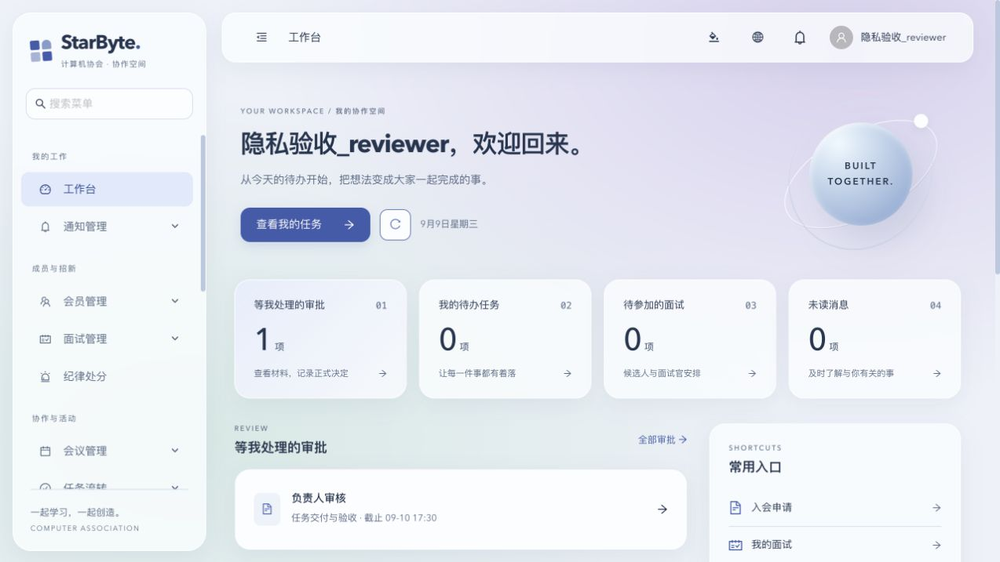
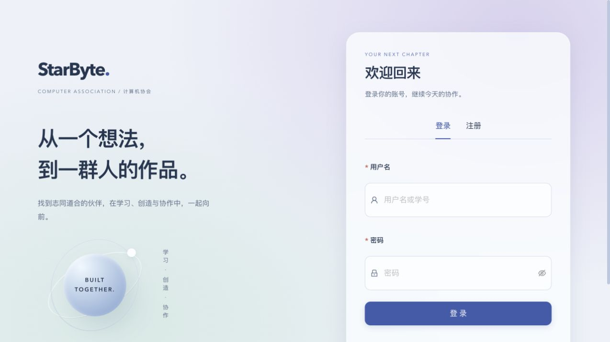

# 协作业务修复与磨砂玻璃界面：阶段审阅说明

本次是可本地运行的阶段草稿，尚未完成整个系统的上线验收。涉及面试、入会审批、会议投票、任务、流程引擎和共享界面；建议维护者按以下顺序审阅。

## 改动与行为

1. **资料审核和正式录用**：会员保留资料审核；干事面试评分与正式签字分离。限制面试管理和评分访问范围；接入正式审批、异议、提醒和试用期维护。
2. **流程一致性**：增加业务审批器、受保护流程图、激活版本校验和事务配合，阻止通用流程入口绕过业务权限或重复跨环节审批。
3. **会议与投票**：细分对象操作权限，匿名投票分离投票身份记录与选票；冻结合格投票人和权重快照；处理投票到期。普通投票展示统计，不自动替代正式决议。
4. **任务执行与验收**：加强对象范围、日志事务、附件清理重试及历史保留；新增执行、提交、审核、验收及返工流程，支持手动、部门、角色和轮流分配。指定执行人可通过本人流程待办操作。
5. **界面**：重做登录、工作台、导航与共享组件，主要业务页面采用磨砂玻璃面板、蓝紫/薄荷背景、CSS 玻璃球、明暗主题及减少动效；调整手机导航、列表和表单。

## 数据库和兼容性

新增迁移 35–47，需在启动新后端前按顺序执行。先备份目标环境数据，在测试环境确认再升级；迁移中涉及隐私数据与历史快照，不应将降级视为无损恢复方式。

已有任务保留原有模式；新任务可使用正式验收流程。旧投票缺少冻结名单时明确标识，不补造历史资格。保留副部长 `vice_minister` 及 `deputy` 别名语义。

## 本地验证

- Go 全量测试：67 个包通过；Go build、go vet 通过。
- 前端：19 项测试通过；TypeScript/Vite 构建通过；lint 0 错误、3 条原有警告。
- 浏览器：桌面 1440px、手机 375px 检查工作台/任务；手机必填校验、创建任务、查询和详情实际操作通过；会议、审批、登录页面抽查通过。
- 单独 API 回归覆盖了评分权限、入会审批、投票匿名性/权重快照、任务对象范围/附件清理、正式任务生命周期/自动分配等路径。完整机器日志和本地测试数据未包含在此 PR。
- GitHub CI 的 race、coverage gate、golangci-lint、镜像构建等更广检查仍以 PR 检查结果为准，以上本地结果不能替代 CI。

复核建议：先执行后端 `go test ./...` 与 `go vet ./...`，前端 `npm run lint`、`npm run test -- --run`、`npm run build`；使用仓库正常初始化的测试环境逐个角色验证上述流程。禁止以真实业务数据做故障注入。

## 剩余工作和审阅重点

- 正式任务转办仍未开放：相关模型、仓库和策略草稿保留，但没有路由、审批器注册或对应新迁移；不要将这些草稿认作已完成功能。
- 任务认领、超时升级/重新分配、正式会议决议法定人数与重试、可靠通知投递，以及其他 Issue 尚需后续实现或验证。
- 外部 SSO、真实邮件、生产部署、安全审查、全业务与性能验收未完成。
- 多个本地预览页重连后曾触发请求限流，稍后刷新恢复；生产前需复核限流预算与多页面重连行为。
- 前端现有大分包警告仍在；3 条 lint 警告位于系统配置、会话管理和用户列表。
- 本阶段超过仓库约 500 行的 PR 建议，暂以单个草稿保存整体审阅入口。合并前需要维护者确认拆分方式、核心模块双人审阅、全部 CI 通过。
- 本 PR 仅关联 Issue，不自动关闭任何尚未完整完成的 Issue。

## 截图

截图使用本地合成验收数据，不含真实成员信息。

